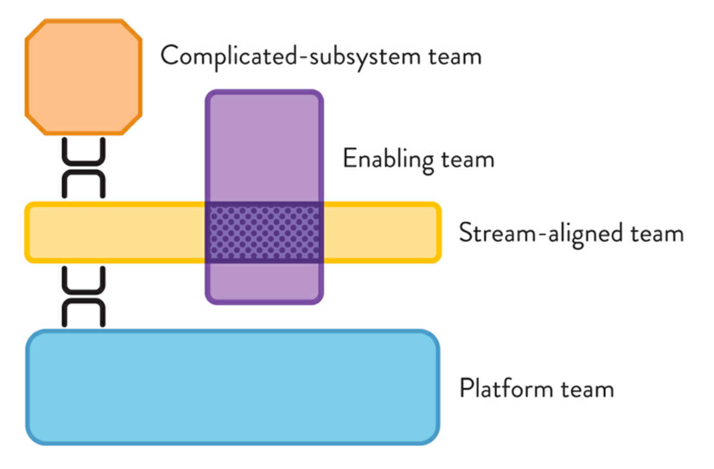

* 제목 : TEAM TOPOLOGIES (팀 토폴로지)
* 매튜 스켈톤, 마누엘 페이스 지음
* 김연수 옮김

# 1부 전달 수단으로서의 팀
## 1. 조직도의 문제점
### 조직 커뮤니케이션 구조
조직도의 의사 전달 방향은 보통 상하향이라는걸 예측할 수 있다.
조직도를 보이는 그대로 취급하는 순간, 구성원 간 커뮤니케이션의 자율성에 제한을 두게 되며..
실제로 사람들은 업무를 수행할 때 조직도에 표시된 보고 단계를 그대로 거치기 보단 선으로 연결 되지 않은 대각선 방향, 혹은 수평 방향으로 의견을 주고 받는다.
### 조직도 중심 사고방식의 문제점
조직도에 기반해 내려진 결정은 일부 집단에만 최적화되기 때문에 해당 결정이 조직도상 상향 또는 하향에 있는 집단에 미칠 영향을 무시하는 경향이 크다.
### 부활한 콘웨이의 법칙
역 콘웨이 전략(inverse Conway maneuver) : 팀이 준수해야 하는 고정된 아키텍처 디자인이 아니라, 시스템이 수행하는 것에 초점을 맞춘 팀 구조 설계에 집중한다. (뒤에 또 나옴)
소프트웨어 아키텍처를 분리해서 설계할 수 있고, 설계 후에는 어떤 그룹이든 이를 구현할 수 있다고 보는 개념이 근본적으로 잘못됐다는 것이 핵심이다.
### 인지 부하(Cognitive Load)와 병목
특정 시간 동안 사람의 뇌가 받아들일 수 있는 정보의 양에는 한계가 있다.
인지 부하를 고려하지 않으면 팀은 단단하게 뭉쳐서 과도한 수준의 책임과 업무를 감당하기 보다는 흩어져 버리기 마련이다. 이런 팀은 그들의 영역에서 전문성을 추구하지 못하고 컨텍스트 전환 비용 때문에 골머리를 앓게 된다.
## 2. 콘웨이의 법칙과 중요성
역 콘웨이 전략 : 조직이 바라는 (소프트웨어) 아키텍처를 구성하려면 그 팀과 조직 구조를 바꿔야 한다는 것이다. 이 전략은 설계부터 배포에 이르는 동안 팀 사이에 폭넓은 커뮤니케이션 활동이 없더라도, 팀이 업무를 완수할 수 있도록 지원하는 것을 목표로 한다.
### 팀 내 흐름을 독려하는 소프트웨어 아키텍처
* 느슨한 결합 : 컴포넌트 사이에 강한 의존성이 존재하면 안 된다.
* 강한 응집력 : 컴포넌트들은 명확한 책임 한계가 있어야 하며 컴포넌트 내부 요소들은 서로 밀접하게 연관돼야 한다.
* 명확하고 적절한 버전 호환성
* 명확하고 적절한 교차팀 테스팅
### 조직 설계와 기술적 전문성
'관리자로 하여금 어떤 팀이 어떤 서비스를 만들 것인지 결정하도록 하는 것은 암묵적으로 그 관리자들에게 시스템 아키텍처를 결정하도록 하는것과 같다.'
소프트웨어 시스템을 구축하는 조직이 기술 분야의 리더를 투입하지 않은 채 팀의 형태와 책임, 경계를 결정하는 것은 비효율적이라는 것이 밝혀졌다.

`아키텍트라 불리는 사람들은 그 어느 때보다 탄탄한 전문 기술과 사회 기술을 갖춰야 한다고 생각한다. 그들은 사회적 프레임워크 안에서 사람과 업무를 동시에 이해해야 한다. 또한, 아키텍트의 영역은 순수 기술의 범위를 넘어서야 한다. 아키텍트는 조직 구조와 개인적 이슈 모두를 다뤄야 한다. 즉, 이들 역시 관리자의 역할을 해야 한다는 것이다.`
### 불필요한 커뮤니케이션 제한
* 팀 내 커뮤니케이션은 고대역폭
* 직접 연결된 두 팀사이의 커뮤니케이션은 중대역폭
* 대부분의 팀 간 커뮤니케이션은 저대역폭

**모든 사람이 모도와 커뮤니케이션할 필요는 없다**
모든 구성원이 모든 채팅 메시지를 봐야만 한다 X
### 주의: 콘웨이의 법칙의 안일한 적용
**도구 선택이 커뮤니케이션 패턴을 이끈다**
팀의 상호 관계를 고려한 후에 조직 전체가 사용할 단일 도구 선택. 독립된 팀들은 별도의 도구를, 협업하는 팀들은 공유 도구를 사용하도록 하라.
### 정리: 콘웨이의 법칙은 효과적인 기술팀 설계에 매우 중요하다
콘웨이의 법칙은 한 조직이 구현하는 소프트웨어 아키텍처에 조직 구조와 실제 팀 간 커뮤니케이션 경로가 그대로 나타남을 설명한다. 팀 자체의 설계와 소프트웨어 설계의 관련성을 인식하지 못하고, 분리해서 설계하려는 시도를 피하고자 한다.
빠른 흐름을 바란다면 팀 간 커뮤니케이션을 제한해야 한다.
## 3. 팀 최우선 사고
### 규모가 작고 오랜 기간 유지되는 팀을 표준으로 삼아라
팀이란 공동의 목적을 달성하기 위해 일하는 단위로 5~9명으로 이뤄진 안정적인 집단이다.

**팀이 소프트웨어를 소유한다**

한 시스템의 변경 권한을 여러 팀에 주게 되면, 변경으로 빚어진 혼란을 다른 팀에 떠넘기기만 하는 문제가 발생한다. 그러나 한 팀이 시스템이나 하위 시스템을 소유하고, 팀 스스로 업무를 계획할 수 있는 자율권을 행사할 수 있다면 결과는 달라진다.
소프트웨어의 모든 부분은 정확히 한 팀이 소유해야 한다. 어떠한 컴포넌트, 라이브러리, 코드도 공동으로 소유해서는 안된다는 의미다.

**팀 구성원들은 팀 최우선 사고방식을 가져야 한다**
* 스탠드업과 회의에는 정시에 도착한다
* 논의 및 조사의 방향을 흩트리지 않는다.
* 팀의 목표에 집중한다.
* 새로운 업무를 시작하기 전, 다른 팀 구성원들이 어려움을 해결하도록 돕는다.
* 새로운 팀 구성원이나 경험이 적은 팀 구성원에게 멘토링을 제공한다.
* 이기려는 논쟁을 피하고 선택 가능한 옵션을 탐색하는 데 함께 한다.
  
**팀 내 다양성을 수용하라**

다양한 배경의 구성원이 모인 팀이 창의적 해결책을 더 빨리 구하고 다른 팀의 요구에 더 잘 공감하는 경향이 있다.

**개인이 아니라 팀 전체에 보상하라**

현대 조직에서 개인 성과에 보상하는 시도는 좋지 않은 결과로 이어져 구성원의 행동에 악영향을 미친다.
  노키아 '조직 전체의 임금 차이가 줄었다. 보너스는 많지 않았고, 팀 단위로 기업 전체 실적에 다라 지급했다. 개인 차원의 보너스는 지급하지 않았다.'
### 좋은 경계는 인지 부하를 최소화한다
팀을 (소프트웨어) 전달의 기본 수단으로 정립했다면, 조직은 각 팀의 인지 부하가 너무 높지 않도록 해줘야 한다.

**팀의 책임을 제한해 팀의 인지 부하와 일치시켜라**

* 내적 인지 부하(intrinsic cognitive load) : 문제 영역의 기본 태스크 관련 인지 부하(예. 자바 클래스 구조란 무엇인가?, 새로운 방법은 어떻게 창출 하는가?
* 외적 인지 부하(extraneous cognitive load) : 수행 중인 업무의 환경 관련 인지 부하(예. 구성요소를 어떻게 재배치해야 하는가? 서비스 설정은 어떻게 해야 하는가?)
* 관련 인지 부하(germane cognitive load) : 학습이나 높은 성과 달성 과정에서 주의해야 할 업무 관련 인지 부하(예. 이 서비스가 ABC 서비스와 어떻게 상호작용 해야 하는가?)

요점만 말하면, 내적 인지 부하를 최소화(교육, 좋은 기술 선택, 채용, 페어 프로그래밍) 하고, 외적 인지 부하를 제거(지루하거나 불필요한 작업, 업무 기억에 가치를 더하지 못하는 작업, 자동화 가능한 작업 등)하려 노력하는 것.
 
**상대적인 도메인 복잡도를 사용해 인지 부하를 측정 하라**

  팀의 인지 부하를 평가하는 방법은 간단하다. 팀 구성원에게 '당신은 효과적으로 일하고 있으며, 주어진 업무에 대해 즉각적으로 대응할 수 있는 상태라고 생각합니까?'
  도메인들을 단순 simple (업무 대부분이 명확한 행동으로 정해진 영역), 난해 complicated (변화를 분석하고, 올바르게 해결하기 위해 솔루션을 몇 차례 반복 적용하는 영역), 복잡 complex (솔루션을 개발하려 많은 실험과 발견을 하는 영역) 단계로 분류한다.
  한 팀에 2~3 개의 단순 도메인을 할당
  복잡한 도메인을 담당하는 팀에 다른 도메인을 더 할당하지 말아야 하는 것이다.
  난해한 도메인을 2개 이상 책임지지 않도록 해야 한다는 것이다.

  **소프트웨어 경계 크기를 팀의 인지 부하와 일치시켜라**

단일 아키텍처와 마이크로스 아키텍처라는 고정된 형태 중 하나를 선택하는 것이 아니라, 이를 책임질 팀의 최대 인지 부하에 맞춰 소프트웨어를 설계하는 것이다.
* 팀 최우선 업무 환경(물리적이거나 실질적인)을 제공하라
* 팀의 업무 몰임도가 저하되는 요인을 최소화하라. 회의를 제한하고, 이메일을 줄이고, 외부 소통은 전담팀이나 전담자가 담당하게 하라.
* 관리 스타일을 변경하라. 방법에 집착하지 말고 목표와 결과를 전달하라. '눈은 두고, 손은 떼라'
* 다른 팀이 느끼는 개발자 경험의 품질을 향상하라. 잘 작성한 문서와 일관성, 좋은 사용자 경험 그리고 다른 개발자 경험 사례를 톨해 다른 팀들이 여러분의 팀이 작성한 코드와 API를 활용할 수 있게 하라.
* 소프트웨어를 구현하는 팀의 인지 부하를 줄이기 위한 목적으로 설계된 플랫폼을 사용하라.
### '팀 API'를 설계해서 팀 상호 작용을 촉진하라

**코드, 문서, 사용자 경험을 포함하는 '팀 API'를 정의하라**

* 코드 : 런타임 엔드포인트, 라이브러리, 클라이언트, 사용자 인터페이스등 팀이 만든 산출물
* 버전 관리 : 팀이 자신이 개발한 코드 및 서비스의 변경 사항을 반영하는 방법
* 위키와 문서 : 팀 소유의 소프트웨어 사용 방법 기술
* 프랙티스와 원칙 : 팀이 선호하는 작업 방식
* 커뮤니케이션 : 팀이 원격 커뮤니케이션 도구에 접근하는 방ㅅ힉
* 업무 정보 : 현재 팀이 작업 중인 사항과 향후 계획 그리고 중단기 업무의 전반적 우선순위
* 기타 : 해당 팀과 상호 교류 하기 위해 다른 팀이 요구하는 기타 사항

`
팀 간 어떠한 코드도 공유하지 않으려 노력했다. 특정 팀이 개발한 기능 관련 깃 저장소의 소유권은 해당 팀에만 있다. 다른 팀이 그 코드 베이스를 추가나 변경을 하고자 한다면 풀 리퀘스트를 보내거나, 교차팀 페어 프로그래밍을 해야 한다.
`
### 정리: 팀의 인지 부하를 제한하고 상호 작용을 촉진해서 빠르게 움직여라
팀은 개인 집단보다 훨씬 중요하다. 대개 팀은 작고 안정적이며 오랜 기간 유지되므로, 팀 구성원이 각자의 업무 유형과 팀의 역학 관계를 개발할 수 있는 시간과 공간을 부여한다.
중요한 것은 팀의 크기 제한으로 인해 한 팀이 감당할 수 있는 효과적 인지 부하에 상한선이 존재한다는 점이다. 따라서, 팀이 다뤄야 할 소프트웨어 시스템 크기와 도메인 복잡성에 제한을 둬야 한다. 팀은 자신이 책임지는 시스템이나 하위 시스템을 소유해야 한다.

# 2부 효과적인 흐름을 만드는 팀토폴리지
## 4 정적 팀 토폴리지
### 팀 안티 패턴
콘웨이의 법칙에 따르면 소프트웨어 시스템을 구현한 팀을 어떻게 구성했느냐에 따라 구현된 시스템의 특성이 결정된다.

첫 번째 안티 패턴은 애드 혹 팀 설계다. 데이터베이스 처리 불량으로 프로덕션 환경에서 소프트웨어 충돌이 발생한 뒤 만들어진 DBA팀 등, 특별한 목적으로 만들어진 팀

두 번째 안티 패턴은 팀 구성원을 뒤섞는 것이다. 이렇게 하면 프로젝트 기반으로 조직했다가 프로젝트 종료 시 즉시 해체하는 휘발성이 매우 강한 팀이 만들어진다. 이때 출시한 애플리케이션의 강화 및 유지보수는 프로젝트에 참여한 엔지니어 중 한 두명이 담당한다. 유연성이 높아져 마감 일정에 더 빨리 대응할 수 있는 방식이지만, 새로운 팀을 형성하고 반복적으로 컨텍스트를 바꾸는 데 필요한 비용은 간과된다. 엔지니어는 어느 팀에 소소됐는지에 따라 업무 수행 성과가 확연히 달라진다.

소프트웨어 시스템의 어느 부분에 경계를 설정해야 시스템 생존성을 보전하고, 빠른 흐름을 유도할 수 있는가?

### 변화 흐름을 위한 설계
#### 팀 내부 커뮤니케이션을 설계함으로써 흐름과 감지를 가능하게 하라
많은 조직이 팀이 소프트웨어 시스템을 구현하고 운영하는 단계 중 일부에서 상호 작용하는 방법에 심각한 오류가 있다. 특히, 이런 기업들은 소프트웨어 전달을 단방향 프로세스, 즉, 명세화 specification -> 설계 design -> 코딩 coding -> 테스팅 testing 과 출시 release -> 일상 비지니스 BAU, business as usual 오퍼레이션으로 간주하는 경향을 보인다.

선형적인 계단식 변화 순서는 변화 속도는 물론 현대 소프트웨어 시스템이 가진 복잡성과 전혀 맞지 않는다.

시스템 설계, 개발, 테스트, 배포, 운영까지 모든 과정을 동일 팀에서 수행해야 한다.

### 데브옵스와 데브옵스 토폴리지
개발팀과 운영팀 간 책임을 완벽하게 분리하는 팀 설계와 상호 작용의 안티 패턴이 주류를 이뤘고, 소프트웨어 출시는 담장 fence 이나 벽 wall 너머로 던져졌으며, 이를 위한 커뮤니케이션 또한 표 ticket 를 통해 이뤄졌다. 데브옵스 세계에서는 이런 현상을 혼동의 벽 wall of confusion 이라 불렀다.
#### 데브옵스 토폴리지
고정된 구조가 아니라 배포할 제품의 종류나 기술적 리더십, 운영 방식과 같은 다양한 요소에 시시각각 영향을 받은 어떤 순간을 묘사한 것(즉, 스냅샷)이다. 다시 말해, 팀은 시간이 지남에 따라 발전하고 변모해야 한다는 것을 내포하고 있다.

데브옵스 토폴로지는 두 가지 핵심 아이디어를 제공한다. (1)데브옵스 성공을 위한 팀 구성 방식에는 만병통치약 같은 접근법이 존재하지 않는다. 모든 토폴로지는 적용되는 조직의 컨텍스트에 따라 그 적합성과 효과가 다르다. (2)데브옵스의 성공을 가로막는 여러 해로운 토폴로지(즉, 안티 패턴)가 존재한다. 이 토폴로지들은 데브옵스 원칙을 어기거나 간과한다.

## 성공적 팀 패턴
부적절한 토폴로지를 선택한다고 해서 반드시 좋지 않은 결과로 이어지는 것은 아니다. 선택한 토폴로지가 바람직한 결과를 내지 못하는 이유는 새로운 팀 구조에만 집중하고, 팀과 그 구조가 놓인 환경을 충분히 고려하지 않았기 때문이다. 다양한 팀의 성공은 팀 구성원의 기술력이나 경험에만 의존하지 않는다. 팀의 성공은 (어쩌면 가장 중요할지도 모를) 팀을 둘러싼 환경과 팀, 그리고 상호 작영에서도 영향을 받는다.

### 피처팀은 높은 엔지니어링 성숙도와 신뢰가 필요하다.
피처팀은 교차기능 및 교차 컴포넌트(cross-component)팀으로서 고객에게 전달할 기능을 구상 단계에서 생산 단계에 이르기까지 담당하고, 만든 기능을 고객에게 전달하며, 이상적으로는 그 사용과 성과까지 추적한다. 이는 좋은 패턴인가, 아니면 안티 패턴인가? 답은 상황에 따라 다르다.

피처팀이 자급자족 self-sufficient 할 수 있을때만 가능하다. 즉, 다른 팀의 작업 결과를 기다리지 않고도 스스로 기능을 생산품으로 전달할 수 있어야 한다는 것이다.

일반적으로 피처팀은 여러 코드베이스에 접근해야 하는데, 그중 일부는 다른 컴포넌트 팀의 소유일 때도 있다. 팀의 엔지니어링 성숙도가 높지 않다면, 새로운 사용자 워크플로우에 대한 테스트를 자동화하지 않거나 보이스카우트 룰(코드에 손을 대기 전 상태보다 더 나은 상태로 만들라)을 지키지 않는, 소위 지름길을 택할 수 있다. 이런 행동은 시간이 지남에 따라 팀 간 신뢰를 떨어뜨리고 기술 부채를 늘리며 전달 속도를 늦춘다.

대규모 프로젝트들은 여러 하위 시스템으로 구성돼 있었으며 팀들은 여러 사이트를 오가며 업무를 수행해야 했다. 각 팀은 5~9명으로 구성됐고 여러 팀이 하나의 하위 시스템을 개발했다. 때로는 매우 큰 규모의 기능을 여러 팀이 동시다발적으로 마치 하나의 큰 피처팀처럼 작업했다. 팀들이 내부 하위 시스템 기능을 개발할 때는 팀 간 커뮤니케이션과 의존성이 급격히 감소했으나, 여전히 누군가는 시스템 전체를 감시하면서 바람직한 사용자 경험과 성능, 신뢰성 기준에 맞춰 하위 시스템들이 통합되고 상호 작용하는지 확인해야만 했다. 이런 이유로 시스템 아키텍트 system architect 와 시스템 오너 system owner, 통합 리드 intergration lead 와 같은 역할이 생겨났다. 결정적으로 이 역할을 맡은 사람들은 커뮤니케이션 통로처럼 프로젝트와 조직 전체를 오가며 기능팀과 직접적이고 빈번하게 상호 작용했다. 이들은 교차 하위 시스템에서 고려해야 할 사항 (인터페이스 통합 등)을 지원함으로써 피처팀들이 일반 기능을 전달하는 리듬을 유지할 수 있도록 했다.

#### 제품팀에겐 하나의 지원 시스템이 필요하다.
제품팀도 인프라스트럭처와 플랫폼, 테스트 환경, 빌드 시스템, 전달 파이프라인에 의존해서 최종 사용자가 사용할 수 있는 것을 전달한다. 제품팀은 이런 의존성 중 일부를 완전히 통제할 수도 있지만, 팀의 자연 인지와 전문성의 한계로 다른 이들의 도움을 필요로 할 것이다.

팀의 자율성을 유지하려면 어떤 일이 끝나기를 기다리느라 멈춰 있지 않도록 하는 것이 핵심이다. 예를 들면, 독립된 QA팀은 제품팀이 일을 마치자마자 그 기능을 정확하게 평가하기가 매우 어렵다.팀들은 저마다 업무량이 있고, 우선순위와 문제가 있다.

차단되지 않는 의존성이란 종종 자급자족할 수 있는 형태(즉, 테스트 환경 구성, 배포 파이프라인 생성, 모니터링 등)로 다른 팀들에 의해 개발 및 유지된다.

예를 들어, 마이크로소프트는 IaaS, PaaS 로 사용할 수 있게 됨에 따라, 팀은 이를 활용해 전달 속도를 현저하게 높혔다.

쉽게 사용할 수 있는 서비스로 구성된 적절한 지원 시스템 혹은 팀이 익숙지 않은 태스크에 활용할 수 있는 전문성이 부족한 상태에서 제품팀을 구성하면 더 많은 병목 현상이 발생한다.

#### 클라우드 팀은 애플리케이션 인프라스트럭처를 만들지 않는다
제품팀은 환경과 자원을 클라우드에 자유롭게 프로비저닝함으로써 필요한 시점에 템플릿을 생성할 수 있어야 한다. 클라우드 팀은 프로비저닝 프로세스를 소유하면서도 필요한 통제나 정책, 감사가 제대로 이루어지는지 보증해야할 수도 있다. 그러나 클라우드 팀은 제품팀의 요구와 적절한 리스크 및 규제 준수 관리의 필요성을 모두 부합하는 고품질의 자체 서비스 공급에 집중해야 한다.

다시 말해, 클라우드 인프라스트럭처 프로세스를 설계하는 책임(클라우드 팀)과 실제 애플리케이션 지원을 공급하고 업데이트하는 책임(제품팀)을 분리해야만 한다.

#### SRE는 일정 규모 이상에서 필요하다
SRE팀 구성원들은 뛰어난 코딩 기술을 갖고 있으며, 무엇보다 코드를 활용해 반복적 운영 태스크에 대한 자동화를 강력하게 추진함으로써 결과적으로 노동의 양을 계속해서 줄인다.

SRE팀은 필수가 아닌 선택이다. "여러분이 진행하는 프로젝트의 규모가 작아지면 SRE가 지원하는 규모 역시 줄여야 하며, 프로젝트의 규모가 SRE의 지원이 필요 없을 정도로 작아지면 팀에서 직접 SRE 업무를 수행해야 한다"

SRE팀과 애플리케이션 개발팀의 관계는 소프트웨어 수명에 따라 변하며, 심지어 매달 달라지기도 한다. 초기에는 애플리케이션 개발팀이 프로덕션 소프트웨어를 SRE의 도움이 필요한 규모가 되는 시점까지 팀 내에서 구축 및 운영한다. 두 번째 단계는 소프트웨어 사용량이 증가하면, SRE가 지침을 제공한다. 애플리케이션 개발팀은 이 지침을 통해 애플리케이션 관련 업무를 글로벌 규모에서 더 잘 수행하는 방법을 얻는다. 이후 해당 소프트웨어의 규모가 충분히 커지면, SRE는 애플리케이션의 운영과 지원에 완전히 참여한다. 어떤 시점이 되면 애플리케이션은 운영 가능성이 떨어져 운영 자체가 어려워지거나, 애플리케이션의 사용성이 크게 떨어져 애플리케이션 팀이 다시 소프트웨어 운영 책임을 맡게 된다.

그러나 SRE 모델을 선뜻 선택하기란 쉽지 않다. "구글과 같은 수준의 엄격한 운영을 하려면 각자가 맡은 부분에 한결같이 헌신해야 한다." 높은 수준의 엔지니어링 원칙과 경영진의 헌신이 있어야 한다.

### 토폴로지 선택 시 고려 사항
#### 기술적 성숙도와 문화적 성숙도
조직의 기술적 문화적 성숙 정도에 따라 효과적인 팀 구조는 달라진다. 예를 들면, 2013년 아마존과 넷플릭스는 모두 잘 수립된 전략을 갖고 있었다.

그러나 애자일을 도입한 전통 기업 대부분은 성숙한 엔지니어링 프랙티스(자동화 테스팅이나 배포 또는 모니터링 등)가 부족했기 때문에, 시간이 지남에 따라 지속 가능한 소도를 유지 하지 못했다. 이 기업들은 뛰어난 엔지니어들로 구성된 일시적인 데브옵스 팀의 도움을 받아 전문성을 확보하고, 공유된 프랙티스와 도구에 기반한 협업으로 팀들을 하나로 모아 운영할 수 있었다.

하지만 임시 데브옵스 팀의 명확한 임무와 해산 시기가 정해지지 않아, 이 팀은 데브옵스 패턴과 또 다른 사일로의 안티 패턴 사이의 옅은 경계를 넘나들었다.

#### 조직 규모, 소프트웨어 규모 및 엔지니어링 성숙도
성숙도가 낮은 조직에겐 처음부터 끝까지 자율적으로 수행하는 팀을 구성하는 데 필요한 엔지니어링 및 제품 개발 역량을 확보하기까지 시간이 걸린다. 반면, 보다 전문화된 팀(개발, 운영, 보안 등)들에겐 긴밀한 협업으로 대기 시간을 최소화하고, 빠르게 문제를 해결할 수 있는한 수용 가능한 수준의 핸드오프다. 조직이나 소프트웨어의 규모가 적당하면 속도를 중심으로 팀 간 긴밀한 협업을 강조하는 패턴이 효과를 발휘한다.

#### 책임 분할을 통한 사일로 파괴
종종 특정 팀에 대한 의존성을 제거하거나 줄일 수 있다. 특정 팀의 책임을 나눈 뒤, 그중 일부를 다른 팀들이 차지할 수 있도록 권한을 부여하면 된다. 예를 들면, 지난 수년간 많은 기업이 데이터베이스 관리자 DBA 로부터 데이터베이스 개발 DB Dev 활동을 분리해왔다.

DBA의 역할은 전형적으로 플랫폼의 일부, 다시 말해 내부적으로 수행하거나 클라우드 제공자가 서비스하는 데이터베이스 애즈 어 서비스 DaaS 의 한 부분이 됐다.

업무량이 증가함에 따라 단순히 팀을 복제하거나 팀 구성원을 추가하는 것이 아니라, 팀 간 의존성 중 무엇을 제거하거나 유지할지 고려해야 한다. 이로 인한 장점이 단점보다 더 많름을 확인했기 때문이다.

### 데브옵스 토폴로지를 활용한 조직 개발
개발팀, 운영팀, 데브옵스팀이 밀접하게 협업할 수 있도록 팀 구조를 바꿨다. 개발팀과 운영팀이 필요한 단계의 자동화를 스스로 만들고 협업할 수 있도록 탈바꿈하는 것이다.

자세한 내용은 생략

### 정리 : 현재 컨텍스트에 적합한 팀 토폴로지를 도입하고 발전시켜라
제품 규모의 조정이나 새로운 기술의 적용, 또는 새로운 시장의 요구 등에 부응하기 위해서 각 상황이 발생할 때마다 팀 구조와 책임을 새로 설정하는 것은 그 순간에는 도움이 될지 모르나, 잘 만들어진 토폴로지에서 얻을 수 있는 속도와 효율성을 기대하기는 힘들다.

외부 상황에 의존한 결정은 주로 개별 팀에 의해 내려지므로, 기술적 문화적 성숙도나 조직 규모, 소프트웨어 규모, 엔지니어링 원칙 또는 팀 간 의존성 등과 같은 조직 수준에 따른 중요 요소에 대한 고려가 부족하다. 그 결과, 팀 구조는 시간이 지난 뒤에도 새로운 문제에 적응할 수 있는 상태가 되지 못하고, 일시적이고 제한적인 범위의 문제에만 최적화된다.

## 5 4가지 기본 팀 토폴로지 
4가지 기본 팀 토폴로지 범위로 좁힐 수 있다.
* 스트림 정렬팀 Stream-aligned team
* 활성화 팀 Enabling team
* 난해한 하위시스템 팀 Complicated-subsystem team
* 플랫폼 팀 Platform team

지아오 루오 Jiao Luo 와 동료들이 2018년 발표한 연구 결과에 따르면, 조직 내 역할에 존재하는 모호성을 줄이는 것이 현대 조직 설계에서 성공을 거두는 핵심 요소다.

기본 팀 토폴로지에서는 의도적으로 운영팀과 지원팀을 정의하지 않는다. 시스템을 구현하는 오랜 기간 동안 유지되는 팀은 구현 중인 시스템의 실제 운영과 밀접한 업무를 수행한다. 핸드오버를 정의하지 않으므로, 운영팀이나 지원팀을 따로 둘 필요가 없다. 심지어 SRE 패턴에서 조차 팀들은 매우 밀접하게 정렬돼 있다.

### 스트림 정렬팀
스트림이란 비즈니스 도메인이나 조직 역량에 맞춘 업무의 지속적 흐름을 의미한다. 지속적 흐름을 달성하려면 목적과 책임을 명확하게 정의해야 한다.

스트림 정렬팀은 조직에서 가장 주요한 팀 유형이며 다른 팀 토폴로지를 따르는 팀들은 스트림 정렬팀의 부하를 줄이기 위해 존재한다. 활성화 팀은 스트림 정렬팀이 현재 가지고 있지 않은 역량을 획득할 수 있도록 연구나 실험을 하고, 성공적인 프랙티스를 제공하려 노력한다. 플랫폼 팀은 낮은 단계의 세부 지식(프로비저닝, 모니터링 혹은 배포 등)을 담당하고, 쉽게 사용할 수 있는 서비스를 제공함으로써 스트림 정렬팀의 인지 부하를 줄이기 위해 존재한다.

스트림 정렬팀은 고객과 가까이 위치하며, 실제 환경에서 운영되는 소프트웨어를 모니터링하는 동안 신속하게 고객의 피드백을 받는다. 그러므로 시스템에서 발생하는 문제에 거의 실시간으로 반응할 수 있고, 필요한 만큼 업무 방향을 조정할 수 있다. 도날드 라이너트센은 "제품 개발 과정에서는 하나의 큰 팀 대신 뛰어난 기술력을 지닌 사람들로 구성한 소규모 팀을 운영할 때, 보다 신속한 방향 전환이 가능하다."

현대 소프트웨어 조직에서는 대부분 팀이 스트림 정렬팀이길 기대한다. 업무 흐름은 명확하고, 각 흐름은 지속적이고 예측 가능한 업무로 구성돼 있어, 스트림 정렬팀들이 우선순위를 정할 수 있기 때문이다. 이는 전통적 업무 할당 방식과 극명하게 대조 된다. 전통적 업무 할당 방식에서는 한 고객의 커다른 요구 사항이나 여러 고객의 작은 요구 사항들을 하나의 프로젝트로 변환했다. 프로젝트가 승인되고 자금이 조달되면, 여러 팀이 참여해(프론트엔드, 백엔드 및 DBA팀 등) 그들의 기존 백로그에 새로운 업무를 추가해야 했다.

#### 사례 연구 : 엄격하게 독립된 서비스 팀(아마존)
제프 베조스는 아마존에서 제공하는 각 서비스나 애플리케이션, 그리고 모든 팀이 콘웨이의 법칙을 따라 실질적으로 독립적이길 원했다. 

* 각 팀은 팀이 개발하고 운영하는 서비스 전반에 책임을 진다(여기에서 서비스란 아마존닷컴 혹은 AWS 서비스 내의 하나 혹은 복수의 기능을 의미한다).
* 모든 서비스는 내 외부를 막론하고 API를 통해 제공한다. 각 팀은 다른 팀이 개발한 서비스 아키텍처나 사용된 기술을 방해하거나 그 어떤 가정도 하지 않아야 한다.

#### 스트림 정렬팀 내 역량
초기 탐색(요구 사항) 단계부터 생산 까지 모든 과정을 수행하기 위해 일련의 역량을 갖춰야 한다.

* 애플리케이션 보안
* 상업 및 운영 측면 생존성 분석
* 설계 및 아키텍처
* 개발 및 코딩
* 인프라스트럭처 및 운영성
* 지표 및 모니터링
* 제품 관리 및 오너십
* 테스팅 및 품질 보증
* 사용자 경험

위 역량이 팀 내 개별 역할에 완벽하게 맞춰지는 게 아니라는 점이 중요하다. 즉, 위에 나열된 역량을 만족시키려면 팀 구성원이 적어도 9명은 돼야 한다는 의미다.

#### 제품팀 혹은 피처팀이 아닌 스트 정렬팀